<!-- 
 -->
**Repository link :** [https://github.com/Ad-Vi/few-shot-learning-LLM-for-irrelevance-classification](https://github.com/Ad-Vi/few-shot-learning-LLM-for-irrelevance-classification)
<!-- 
 -->

# Few shots learning LLM for Relevance Classification

- [Dataset](#dataset)
- [Implementation](#implementation)
  - [Model : Distil BERT](#model--distil-bert)
  - [Low-Rank Adaptation (LoRA) - APPROACH 1](#low-rank-adaptation-lora---approach-1)
    - [Training](#training)
  - [Model fine-tuning - APPROACH 2](#model-fine-tuning---approach-2)
    - [Training](#training-1)
  - [Results](#results)
  - [Limitations](#limitations)
- [Contributors](#contributors)

Project done in the scope of the course *Web and Text Analytics given at the University of Liège in 2023*.  
The approach taken is to fine-tune a small existing model using the dataset provided by the Teaching Staff.

## Dataset

The [dataset](data/WaTA_dataset.csv) is composed of 25112 sentences, each classified as being relevant to the context or not. The context of relevance is thus the whole dataset context (the 25112 sentences).  
This dataset is unbalanced with 75% of the sentences being relevant and 25% being irrelevant.

## Implementation

### Model : Distil BERT

The model used is [distilbert-base-uncased](https://huggingface.co/distilbert-base-uncased). It is a small transformer model distilled from the [bert-base-uncased transformer model](https://huggingface.co/bert-base-uncased) keeping 95% of its performance for 60% with parameters and being 60% faster than bert-base-uncased.  
It offers the advantages of being small and thus possible to train with limited resources and having good performances in regards to other bigger transformer models.

### Low-Rank Adaptation (LoRA) - APPROACH 1

<table>
  <tr>
    <td>
    The principle of LoRA is to freeze the initial model parameters and to fine-tune additional parameters to adapt the model to a new task. This yields an adaptation of the initial model with a relatively low number of parameters to train. 
    This first approach can be found in the <a href="https://github.com/Ad-Vi/few-shot-learning-LLM-for-irrelevance-classification/blob/main/distil-bert_lora.ipynb">LoRA notebook</a>
    </td>
    <td>
        
    </td>
  </tr>
</table>

#### Training 

<table>
  <tr>
    <td>Training Set Loss 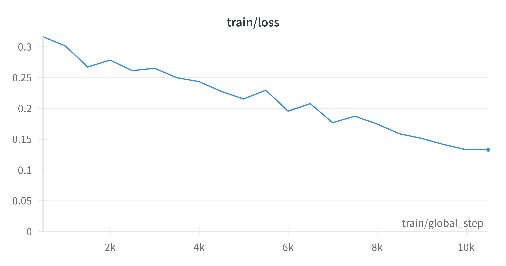</td>
    <td>Evaluation Loss 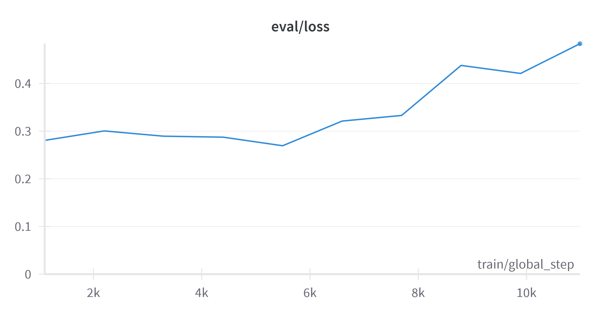</td>
  </tr>
  <tr>
    <td>Evaluation Accuracy 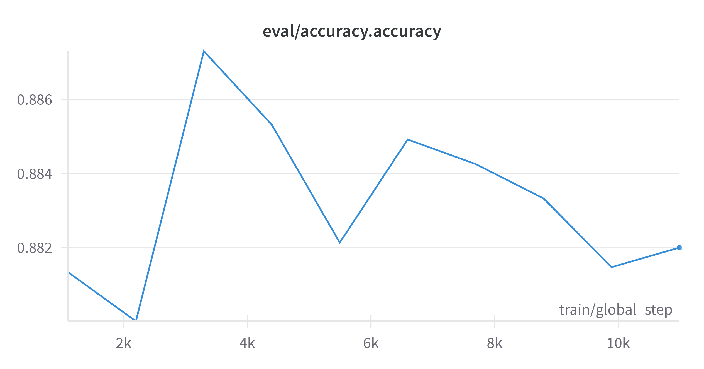</td>
    <td>Evaluation Precision 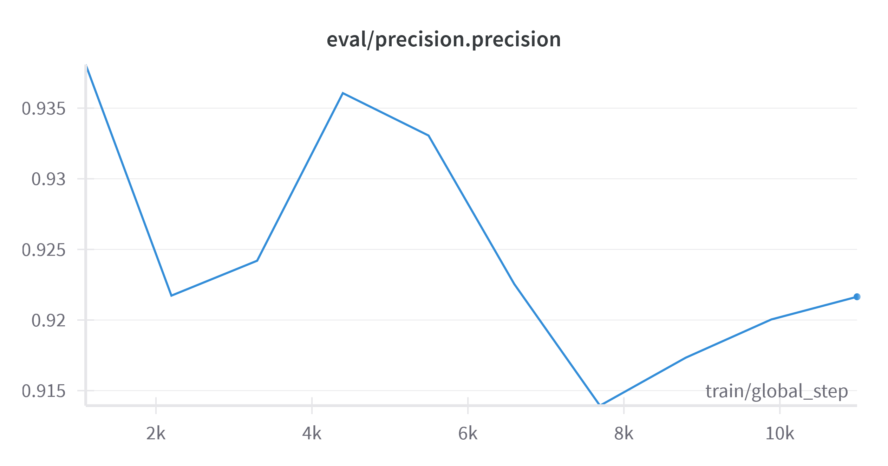</td>
  </tr>
  <tr>
    <td>Evaluation Recall 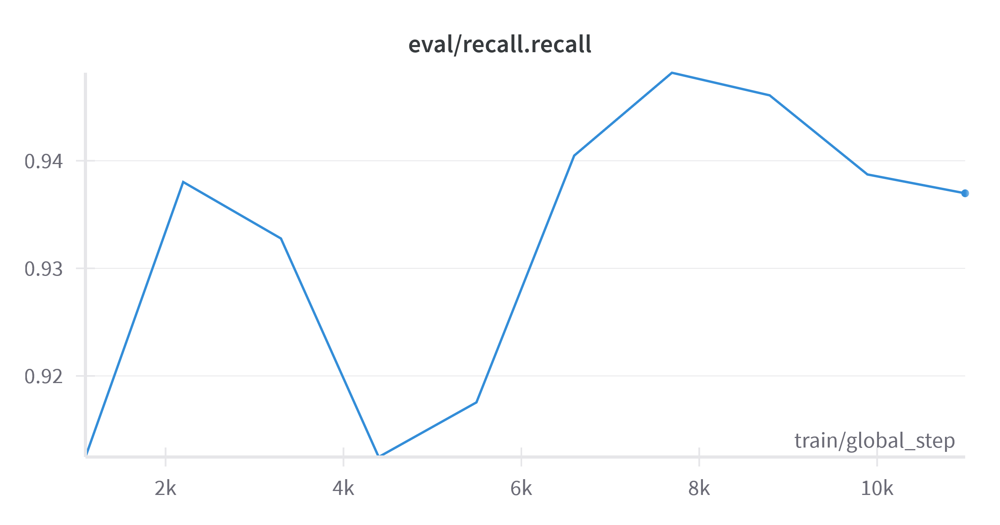</td>
    <td>Evaluation F1-score 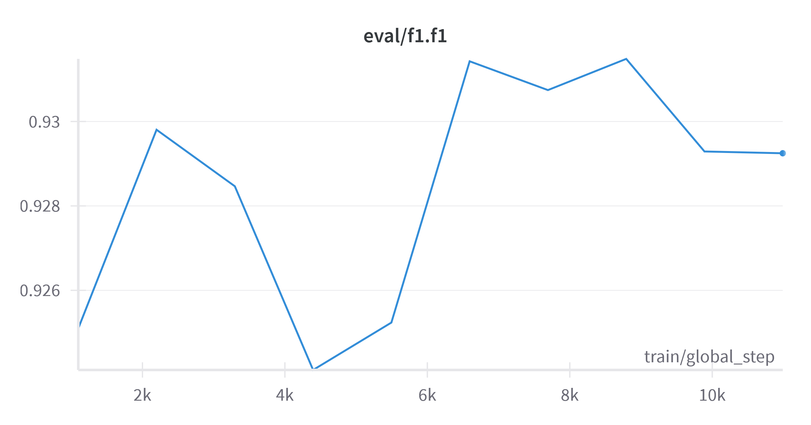</td>
  </tr>
</table>

From the training loss and the evaluation loss, we can see that the model is not overfitting. The evaluation loss is decreasing and the evaluation accuracy is increasing.

### Model fine-tuning - APPROACH 2
<table>
  <tr>
    <td>
    The second approach is to fine-tune the whole model or only a fully connected neural module (head) that is on top of the model.   
    This head is composed of a Linear layer, a ReLU activation function, another Linear layer and a softmax.   
    This approach can be found in the <a href="https://github.com/Ad-Vi/few-shot-learning-LLM-for-irrelevance-classification/blob/main/distilbert-classifier.ipynb">fine tuning notebook</a>. 
    </td>
    <td>
        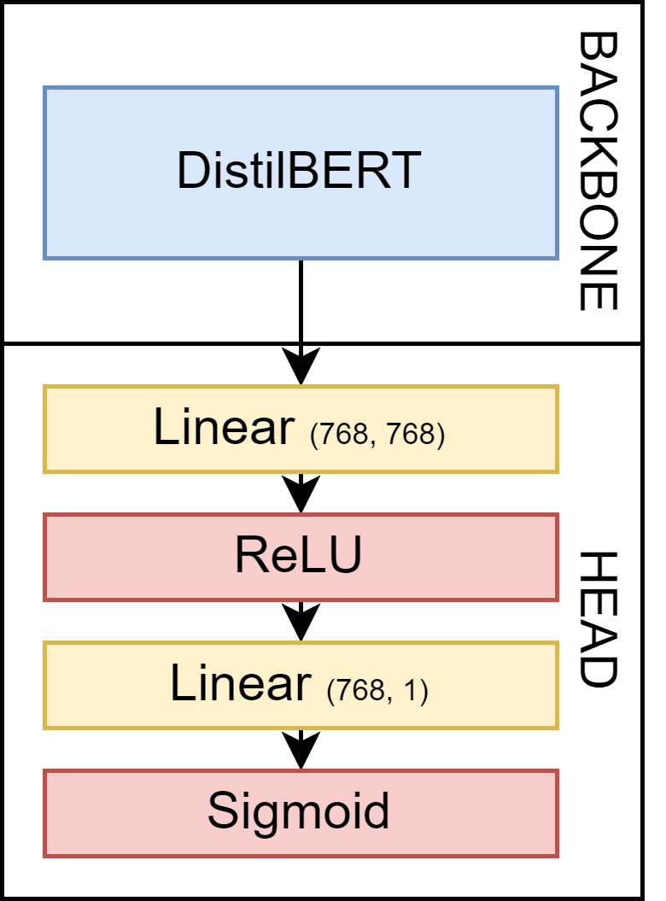
    </td>
  </tr>
</table>

#### Training 

The following graphs are obtained by fine-tuning only the fully connected module.
<table>
  <tr>
    <td>Training Set Loss 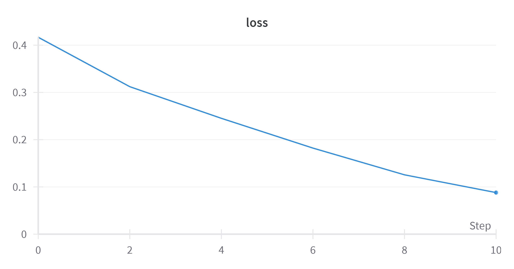</td>
    <td>Evaluation Loss 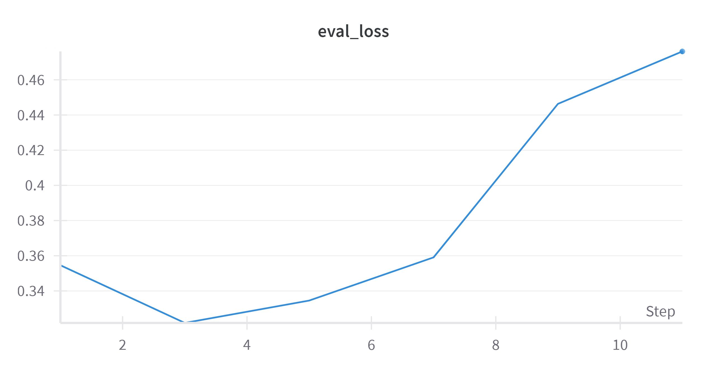</td>
  </tr>
  <tr>
    <td>Evaluation Accuracy 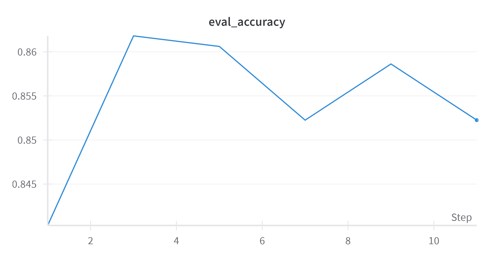</td>
    <td>Evaluation Precision 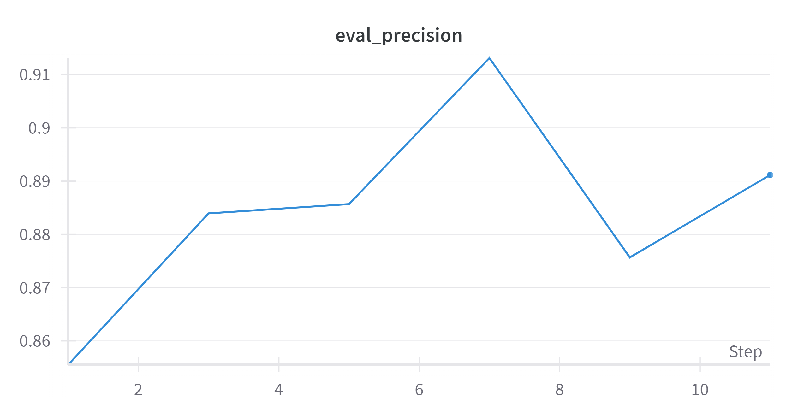</td>
  </tr>
  <tr>
    <td>Evaluation Recall 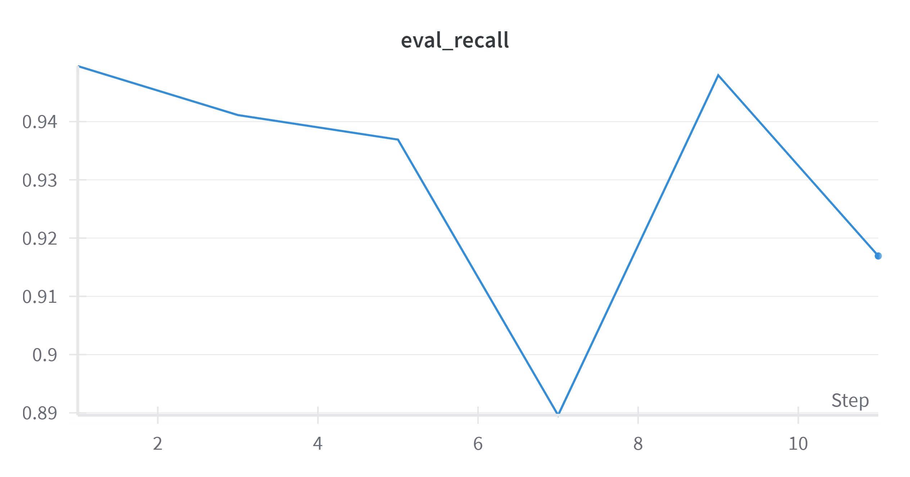</td>
    <td>Evaluation F1-score 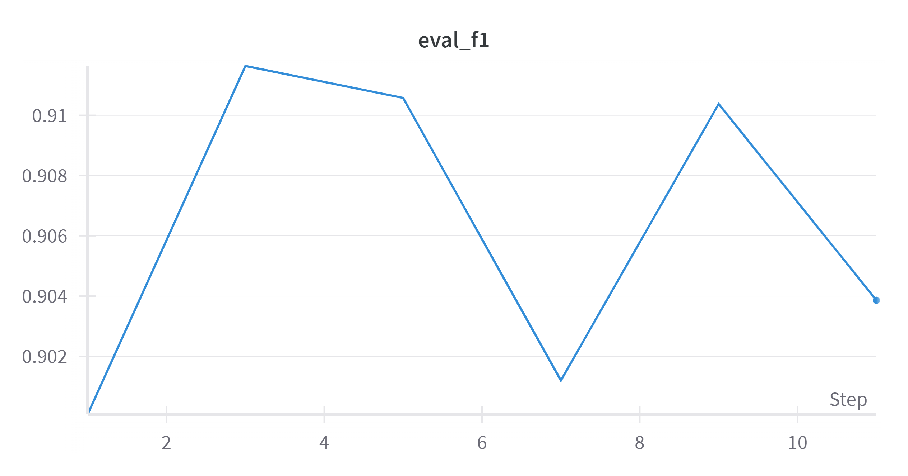</td>
  </tr>
</table>

Here again, the model overfits quickly. The training set loss is decreasing and the evaluation loss is increasing.  
We can see that the optimal epoch is the third one.

### Results

At the end of the fine-tuning:

| Method | Epoch | Training Set Loss | Test Set Loss | Test Set Accuracy | Test Set Precision | Test Set Recall | Test Set F1-score |
|-------|------|---------------|------------------|----------|-----------|--------|----|
| LoRA    | 10 | 0.122800      | 0.493573         | 0.8918   | 0.9216    | 0.937  | 0.8566 |
| Head FC Fine-tuning    | 10 |       | 0.58726 | 0.86140   | 0.89401    | 0.92691  | 0.91017 |
| Full Model Fine-tuning    | 10 |   0.2478    | 0.3217 | 0.86061   | 0.89917    | 0.9190  | 0.908996 |

The results show that LoRA outperforms the naive fine-tuning methods.

### Limitations

Our implementations have some limitations. First, the dataset allows training of the model to learn the relevance in regards to the whole dataset context. However, the model is not able to learn the relevance in regards to a specific context due to the lack of different contexts in the data.
Another limitation is the size of the model chosen. Such a small model had been chosen to be able to train it with limited resources. Another model could have been chosen to have better performances if more computation ressources were available.
Finally, the dataset is unbalanced. This leads to a bias in the model. The model is more likely to predict a sentence as being relevant than irrelevant. On the other hand, such an unbalanced dataset allows to have a higher relevance context.

## Contributors

The team which contributes to this work is composed of :

- [Cédric HONS](https://github.com/cedhons)
- [Dylan PROVOOST](https://github.com/Deimort)
- [Adrien VINDERS](https://github.com/Ad-Vi)
